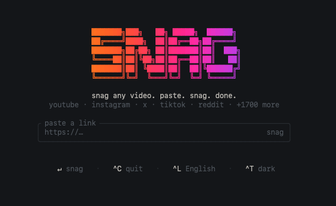
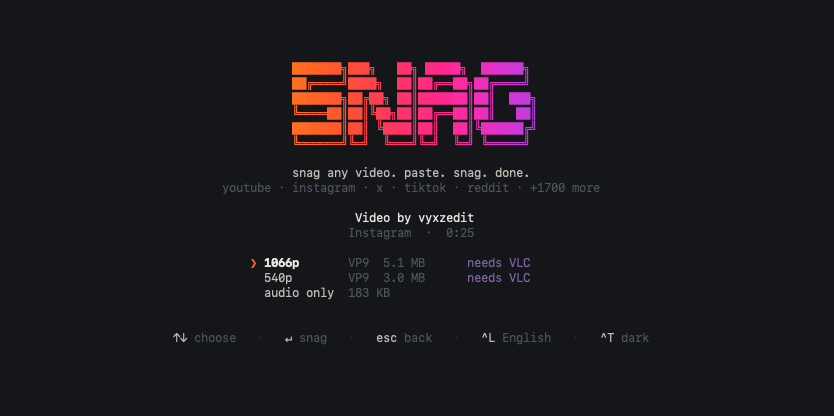

# snag

**snag any video. paste. snag. done.**

Download videos from YouTube, Instagram, X, TikTok, Reddit and 1,700+ other
sites, from your terminal. Paste a link, pick a quality, done. No popups, no
fake download buttons, no sketchy redirects.



## Install

The only thing you need first is [Node.js](https://nodejs.org) 18 or newer.
Check with `node --version`; if that fails, install it from nodejs.org.

```sh
git clone https://github.com/liuksaa/snag.git
cd snag
npm link
```

That's it. `snag` now works from any folder.

**No other setup.** Under the hood snag uses two tools, yt-dlp and ffmpeg, but
you do not have to install either one. The first time snag needs a tool it
downloads it for you into `~/.snag/bin` (around 45 MB, once). If you already
have them on your system, snag uses those and downloads nothing.

## Use it

```sh
snag                       # opens snag, pre-filled with any link you copied
snag <url>                 # straight to the quality picker
snag --help
```

Type or paste a link and press enter. Pick a quality with ↑/↓ and press enter
again. Files land in `~/Downloads`, and snag says where.

Press a number on the home screen to grab one of your recent links again.
`esc` goes back, `^C` quits.

| key | what it does |
| --- | --- |
| `↵` | snag the link |
| `1`–`5` | re-snag a recent link |
| `↑` `↓` | move through the quality list |
| `^T` | theme: auto, light, dark |
| `^L` | language |
| `esc` | back or cancel |
| `^C` | quit |

## Themes

`^T` cycles **auto**, **light** and **dark**, and remembers your choice.

`auto` is the default and usually the right one: it paints with your
terminal's own colours, so snag matches whatever theme you already use. Pick
`light` or `dark` if you want snag to look the same everywhere regardless.

## The quality picker tells you what will actually play

Apple's players (QuickTime, Preview, Photos, Messages) can only decode H.264
and H.265. Most download tools ask for "best quality", which on YouTube and
Instagram is usually VP9 or AV1 — so the file arrives and macOS plays the sound
with a black screen.

snag labels every option with the codec you are actually getting:



Here every option this reel offers is VP9, so all of them are marked. When a
site does offer an H.264 version, that one is starred instead.

The ★ is the sharpest option that plays everywhere. Take it and the file just
opens. Take a `needs VLC` one when you want maximum quality and don't mind
using [VLC](https://www.videolan.org).

## Languages

snag follows whatever language your system is set to, and falls back to English
if it has no translation for it.

Press `^L` to open the language list, pick one with the arrow keys, and press
enter. Your choice is remembered, so snag opens in it from then on. To override
it for a single run:

```sh
SNAG_LANG=hi snag
```

Available: English, हिन्दी, Español, Português, Français, Deutsch, Русский,
日本語, 中文, Indonesia, Türkçe.

Interface text is translated. Longer diagnostic messages (why a specific link
failed) are still English only, and translations are welcome.

Text is measured in terminal columns rather than characters, so Chinese,
Japanese and emoji stay aligned instead of pushing the layout sideways.

## Sites that need a login

Instagram and private or age-gated videos only serve video to signed-in users.
snag handles that by borrowing the cookies from the browser you use most, so
being logged in there is all you need. macOS will ask once for Keychain
permission, which is the system checking you meant to allow it.

To choose a browser yourself:

```sh
SNAG_BROWSER=brave snag     # also chrome, firefox, edge, safari
```

Safari additionally needs Full Disk Access for your terminal.

## What isn't supported

**Threads.** yt-dlp has no Threads extractor, so those links cannot be
downloaded by anything built on it. If the clip is also on Instagram, use that
link. snag tells you this instead of failing cryptically.

## How it works

- [yt-dlp](https://github.com/yt-dlp/yt-dlp) does the talking to each site.
  snag fetches the standalone binary on first use, so Python is not required.
- ffmpeg joins separate video and audio streams and makes mp3s. snag fetches a
  static build on first use if your system has none.
- The interface is plain ANSI escape codes. No UI framework, no dependencies,
  which is why it starts instantly.

## Development

```sh
npm start            # run it
npm test             # unit tests
npm run check        # type-check the JavaScript
npm run vibe         # flip through alternative front-page designs
npm run keys         # see what your terminal sends for a given key
```

The source is plain JavaScript and is never compiled, so a clone runs as-is.
Types are declared in JSDoc comments and checked by `npm run check`, which
catches the mistakes a compiler would while keeping the runtime dependency
free. Shared shapes live in `src/types.mjs`.

```
src/
  paint     colour, the aurora ramp, sizes and clocks
  screen    the alternate buffer, raw keys, and the redraw loop
  logo      the wordmark and its shimmer
  views     every screen as a pure function: state in, lines out
  main      the state machine
  core/     engine (yt-dlp), formats (the codec-aware menu),
            access (logins), links (reading urls), recent, clipboard
```

## A note on fair use

snag is a personal archiving tool. Downloading may go against a platform's
terms of service, so keep to what you have the right to keep, and be good to
the people who made it.

## License

[MIT](LICENSE)
